# FastSimplex

GPU simplex noise for Python. Provides significant performance improvements over CPU-based implementations, especially for 3D noise generation.

Uses custom Metal/CUDA kernels for extremely fast generation on most devices.


## Installation

```bash
pip install git+https://github.com/Greg-Tarr/fastsimplex.git
```

## Usage

```python
import torch
from fastsimplex import noise2, noise3

# 2D noise
x = torch.linspace(-1, 1, 256)
y = torch.linspace(-1, 1, 256)
X, Y = torch.meshgrid(x, y, indexing="ij")
noise_2d = noise2(X, Y, octaves=4, persistence=0.5, lacunarity=2.0)

# 3D noise
z = torch.linspace(-1, 1, 256)
X, Y, Z = torch.meshgrid(x, y, z, indexing="ij")
noise_3d = noise3(X, Y, Z, octaves=4, persistence=0.5, lacunarity=2.0)
```

## Performance

See `scripts/benchmark.py` for detailed benchmarks. Generally achieves:
- 4-5x speedup for 2D noise generation
- 80-100x speedup for 3D noise generation

## Gallery

### 2D Noise Examples
#### CUDA Backend
Scale 25.0:
<p float="left">
  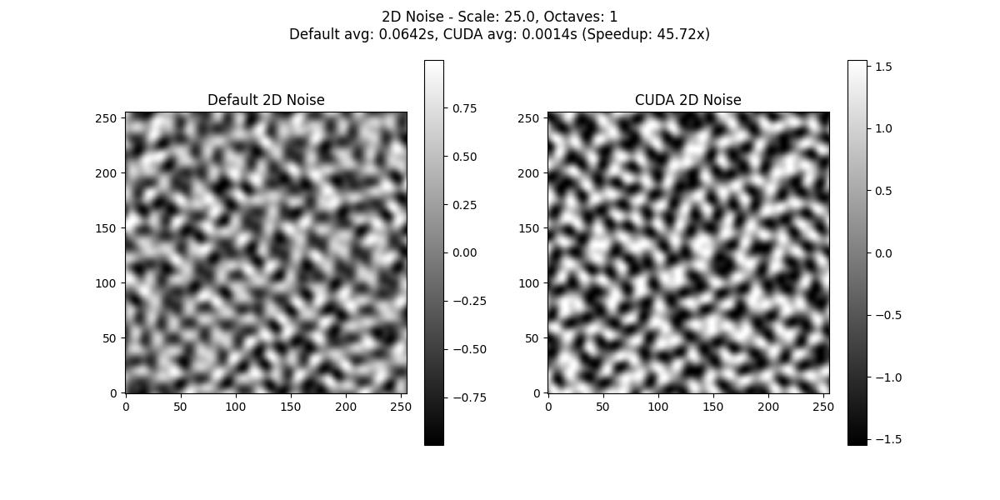
  
  
  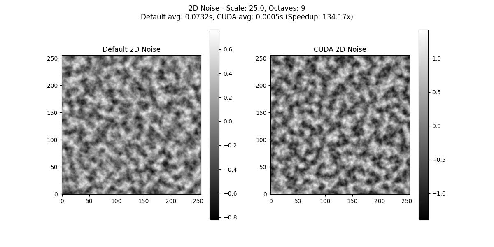
</p>

Scale 50.0:
<p float="left">
  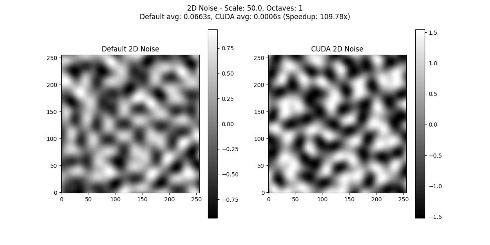
  
  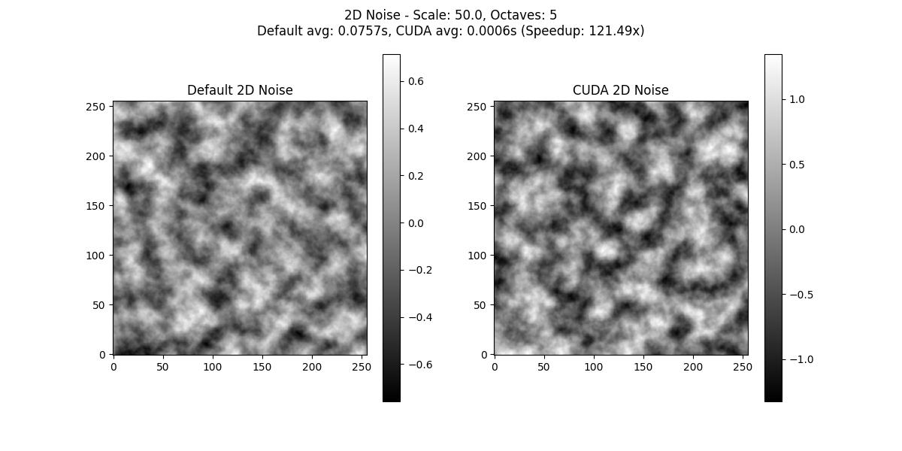
  
</p>

#### MPS Backend (Apple Silicon)
Scale 25.0:
<p float="left">
  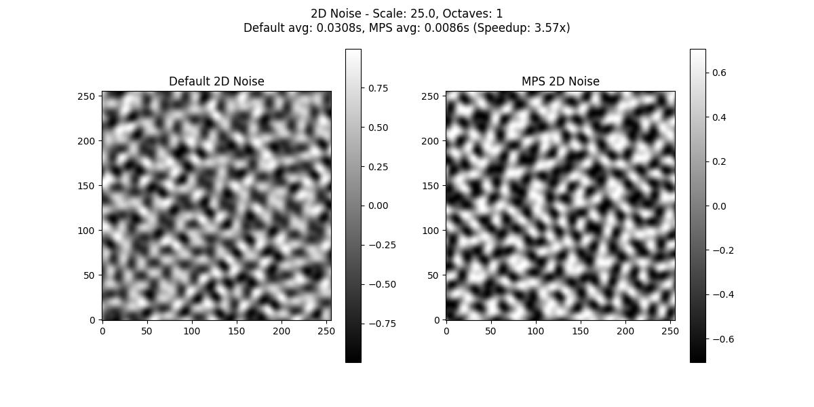
  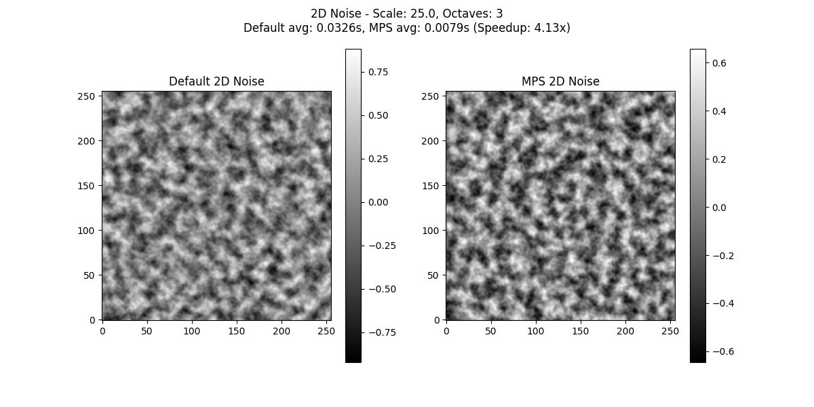
  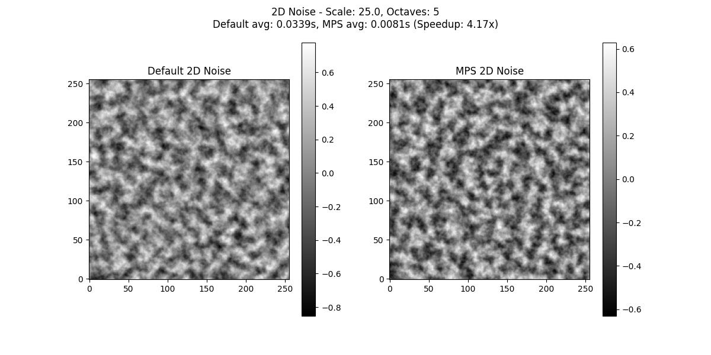
  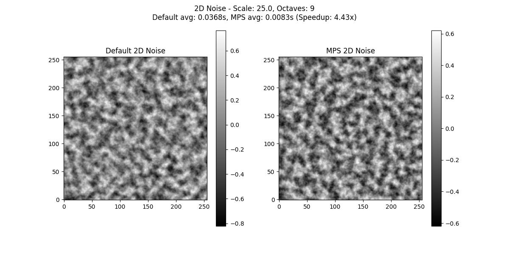
</p>

Scale 50.0:
<p float="left">
  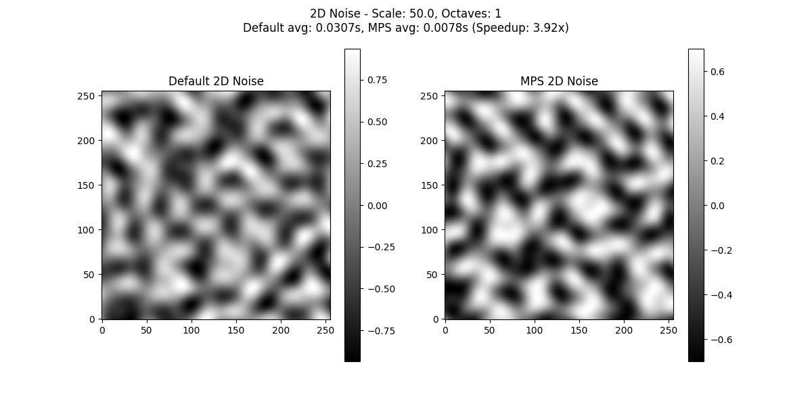
  
  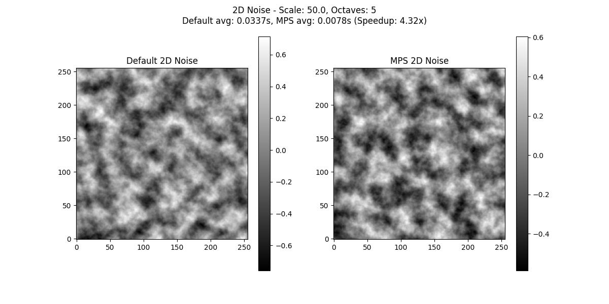
  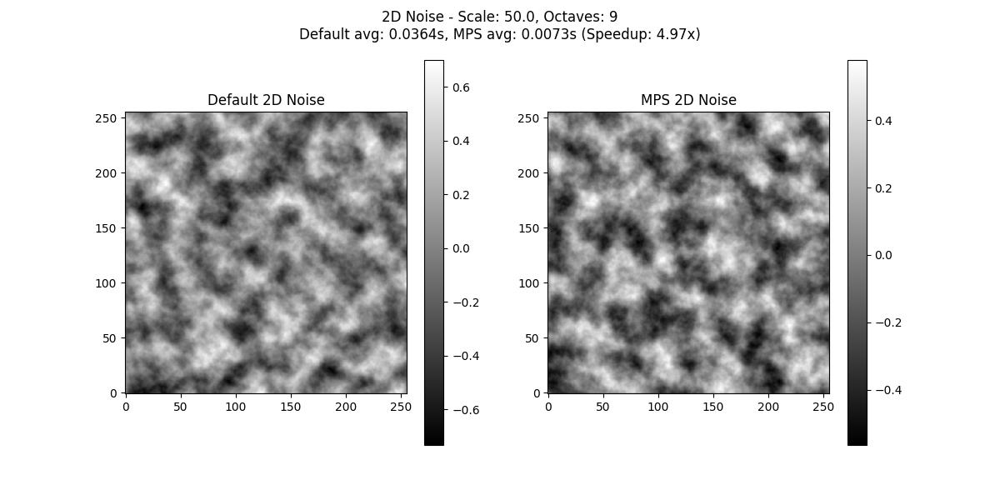
</p>

### 3D Noise Examples
#### CUDA Backend
Scale 25.0:
<p float="left">
  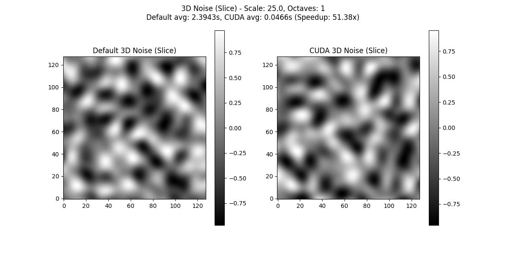
  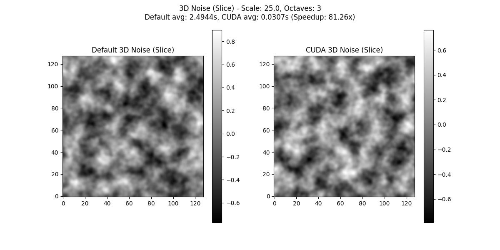
  
  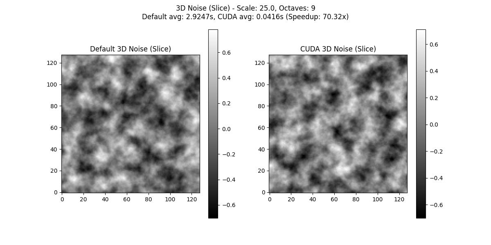
</p>

Scale 50.0:
<p float="left">
  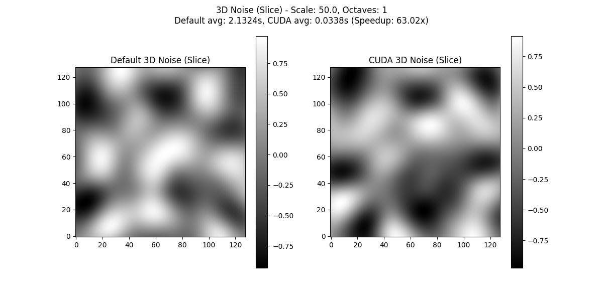
  
  
  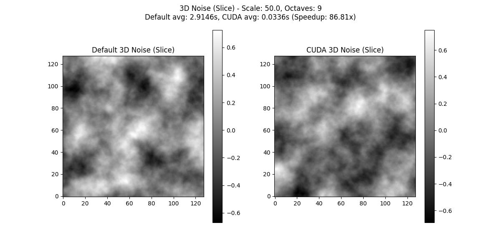
</p>

#### MPS Backend (Apple Silicon)
Scale 25.0:
<p float="left">
  
  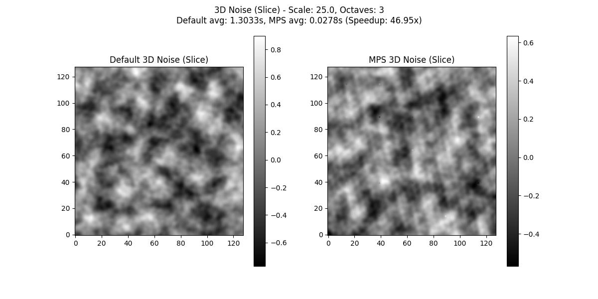
  
  
</p>

Scale 50.0:
<p float="left">
  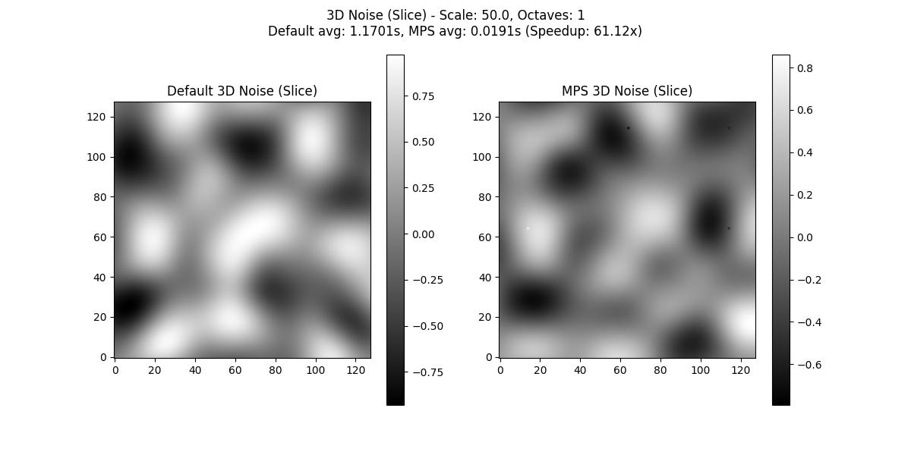
</p>


## Requirements

- Python 3.12 or later
- PyTorch 2.6.0 or later
- CUDA-capable GPU (for CUDA backend) or Apple Silicon (for MPS backend)
